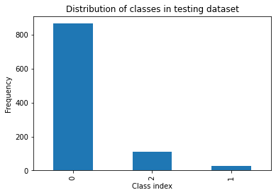

# CYBER BULLYING DETECTION END-TO-END ML APP

This repository contains source code for simple end-to-end cyberbullying detector
application. Produced artifacts are deployed in the following way:


Users are able to classify **polish** tweets with Python interpreter that has installed
the `cbd_client` package (available [on PyPi](https://pypi.org/project/cbd-client/)) or
any other http protocol tool like [Postman](https://www.postman.com/). When they send
request to flask application, the deployed ML model is inferred to classify text into
one of following classes (non-harmful, cyberbullying, hate_speech).

## TLDR

In order to see how the app works go to `demo` folder and follow the manual.

## Contents of repository

Repository consists of following modules:

```
.
├── client
├── demo
├── docs
└── ml_pipeline
    ├── app
    └── svm
```

### Client

This module contains source code of the `cbd-client` package.

### Docs

This module contains images that are rendered here.

### Demo

This module contains the Jupyter Notebook that shows how the solution works in reality.
Simple manual of environment configuration is also attached.

### ML Pipeline

This module contains source code of the web application and machine learning aspects of
the project. The `app` directory stores the Flask application. The `svm` directory
stores the entire machine learning "pipeline" to (1) produce dataset, (2) train model,
(3) inference the model. It also includes data sets and evaluation scripts.

## Artifacts

Entire codebase is designed to produce three, following artifacts:

- **Machine Learning model** that classify input tweets as non-harmful, cyberbullying or
  hate_speech (can be found directly [in the repo](ml_pipeline/model.pkl))
- **Docker image** which contains the web application that serves the model inference
  (can be found [on Docker Hub](https://hub.docker.com/r/antyfilidor/cbd)); it's good to
  mention that is weights only about 200 MB
- **Python package** which facilitates clients to connect with application service and
  query the api to inference model (can be found
  [on PyPi](https://pypi.org/project/cbd-client/))

## Continuous integration

To facilitate the integration works we decided to implement two CI pipelines, so that
main artifacts can be automatically built. Due to the fact that GitHub was chosen as
DevOps platform, we implemented, so called, GitHub Actions. They are stored in the
`.github` folder.

`docker-image.yml` includes pipeline that automatically builds docker image that
contains the application to serve the CBD model. After docker image is built, the
pipeline publishes it on the Docker Hub.

`package-build.yml` includes pipeline that automatically builds and publish on pypi.org
the Python package that includes client code.

## Code quality

In order to create the code that can be relatively easy read by side programmers, we
decided to use [pre-commit](https://pre-commit.com/) tool that enables to run inspection
tools over the code at every attempt to commit changes in the repository. The
configuration file can be found [here](.pre-commit-config.yml). Briefly, it executes
lints like Black, Flake8 or MyPy and unit-test that have been created.

## Software engineering - discussion

It's obvious that this code can be implemented better, however the time limit to finish
the prototype enforced us to balance between transparency of solution and its
sophistication. Although some actions have been done to bring code of good quality, we
are aware that there are many things that can be done in the future in this field, like:

- move tests from local pre-commit hook to GitHub action,
- prepare MLOps pipeline that automatically process datasets, builds model and deploy
  it,
- write more tests (not only unit),
- modify rest api so that it can also handle batch requests,
- modify the `docker-image.yml` so that it can automatically update docker image on the
  GCP machine,
- in case of need to change model do deep one, we can consider using GCP machine and
  Docker image that supports GPU acceleration,
- check all licenses of used libraries (use e.g. [FOSSA](https://fossa.com/) tool),
- prepare documentation of the code and publish it online (use e.g.
  [Sphinx](https://www.sphinx-doc.org/en/master/) and
  [Read the Docs](https://readthedocs.org/) server).

## Machine learning - model choice rationale

The Machine learning model is an integral part of entire solution. Therefore, in order
to determine the way should be designed, one must balance between many factors. Of
course, we can exclude entire business domain, because the purpose of this
implementation is to prepare end-to-end solution in short time, with no budget, and by
one person. Nonetheless, factors like available data and its quality, computational
power, simplicity of model and so on must be taken into account. Hence, we determined a
following approach.

### Analysis of existing solutions

In this step we searched for articles and web tutorials how this problem is being
solved. Of course there are many existing solutions, but no for Polish language.

Hopefully the results from PolEval 2019 competition were
[available](http://2019.poleval.pl/files/poleval2019.pdf), and that helped a lot in
further development. The chapter "Results of the PolEval 2019 Shared Task 6: First
Dataset and Open Shared Task for Automatic Cyberbullying Detection in Polish Twitter"
described in comprehensive way the way dataset was collected and from high level point
of view submitted solutions by competitors. The
[result table](http://2019.poleval.pl/index.php/results/) contained names of models, and
a score they gained. Moreover, the description of Task 6.2 (the very same this project
implements) contained the evaluation script written in Pearl to assess the model. We
noted particularly two submissions - the winning one (Maciej Biesek's), and the one
presented by Katarzyna Krasnowska-Kieraś and Alina Wróblewska. First was interesting
because of the fact, that mr Biesek tested three different models, and the simplest
turned out to be the best in the entire competition. The approach presented by ladies
mentioned above was interesting, because it showed a very promising way to enhance the
dataset.

### Dataset overview

In order to analyse the dataset we decided first to read collected tweets. All of them
were anonimised (the account name has been replaced with '@anonymized_account'). Dataset
included emoticons, that can be helpful in detection of their emotional content.
However, contrary to authors of the dataset, it has not been cleaned very well. There
were a lot of tweets that contained a special-escape characters, like '\\n' '\'' etc.
Their presence was certainly related with encoding mismatch during pulling tweets via
api, and it couldn't been easily fixed in preprocessing pipeline.

The second thing was the analysis of classes distribution. In order to do it we plotted
following bar plots via Matplotlib:

|   |   |
| :--------------------------------: | :-------------------------------: |
| Classes distribution in train data | Classes distribution in test data |

As we can see, the original dataset was highly imbalanced, and that should be taken into
account during implementation.

### Selection of a baseline model

As a baseline we decided to base on code of Maciej Biesek, who won the competition. He
uploaded three different algorithms - supported vector machine (1st place), recurrent
neural network (6th place) and Flair model (4th place). Eventually we decided to use the
SVM because of its performance and simplicity (e.g. we expected to obtain light model).

Entire [code](https://github.com/maciejbiesek/poleval-cyberbullying) is available on
GitHub. We must admit, it contains very clear scripts, which, considering its prototype
character, facilitates understanding of his approach.

### Inference with existing models

Mr Biesek’s repository doesn't contain any listing of libraries, that made us difficult
to reproduce the python environment. Fortunately we had serialised models there, and
that was an ‘anchor point’ for recreating step. After it was completed, we successfully
ran SVM and obtained the same values of metrics as are listed in official results. We
also trained a new one with no modification of the code which resulted in the same way.

### Choice of validation metrics

Since we decided to 'get inspired' by PolEval competitors, the usage of its evaluation
script became natural. Therefore, to validate obtained models we computed Micro-Average
F-score and Macro-Average F-score over the PolEval testing dataset.

### Experiments & results

After we reproduced mr Biesek's pipeline, our first thought was to borrow idea from mrs
Krasnowska-Kieraś and try to enhance available data in order to reduce imbalance. In the
additional script (`ml_pipeline/svm/enhance_dataset.py`) a pipeline that perform
translating loop using Google Translator API was implemented. With it, we added about
1500 tweets from two most niche classes, which changed the data distribution:

<p align="center"></p>

The next idea that followed to improve the tweet processing and to remove some
artifacts, especially from tweets that have been added to dataset. We did it by
modification of `ml_pipeline/smv/svm_classifier.py`.

Below we also present a set of results we obtained:

|                 Model name                  | Micro-Average F1 | Macro-Average F1 |
| :-----------------------------------------: | :--------------: | :--------------: |
|         PolEval2019 Baseline model          |       87.6       |       51.8       |
|            PolEval2019 Own model            |       87.7       |       52.0       |
|       Dataset enhanced (PL>EN>DE>PL)        |       87.5       |       55.6       |
|        Improved sentence processing         |       86.7       |       54.6       |
| Dataset enhanced (PL>EN>DE>PL, PL>CZ>RU>PL) |       86.4       |       53.2       |

Despite changes in the original pipeline, we decided to keep its main architecture, that
can be presented in the diagram below:


## Machine learning - discussion

In the pipeline we skipped step of parameters tuning. It has been done because of lack
of time, anyway we can (wih small effort) use some out of the box methods provided in
`Scikit Image` like
[Grid search](https://scikit-learn.org/stable/modules/generated/sklearn.model_selection.GridSearchCV.html#sklearn.model_selection.GridSearchCV),
[Randomized search](https://scikit-learn.org/stable/modules/generated/sklearn.model_selection.RandomizedSearchCV.html#sklearn.model_selection.RandomizedSearchCV)
. With them, we will be able to obtain parameters of the model that result with the best
performance of classifier on given dataset. In case it won't be to do it on the complex
classifier (like the sklearn Pipeline) we can do it only on SVC.

We can also use
[K-fold cross validation with stratification](https://scikit-learn.org/stable/modules/cross_validation.html)
to improve model fitting.

Continuing with dataset improvment is also a good idea. Machine translations that has
been done with Google Translate API were not perfect and quite messy. Therefore, we can
try to simplify them by removing one step, for instance instead of pl->en->de->pl go
with pl->en->pl. We can also use only West Slavic languages (Czech, Slovakian,
Lausitzian) to improve the quality of translations.

Originally, we intended to test more algorithms than one, but lack of time made it
impossible. The most interesting would be implementing a RNN like LSTM (especially that
we have a baseline from PolEval 2019). We can also use some pre-trained models and
perform the transfer-learning ( like [n-waves](https://github.com/n-waves/multifit)).

In case of promising results we can think of ensembling those classifiers to improve
results.

## References

Software engineering:

- Flask app
  [article](https://xaviervasques.medium.com/machine-learning-prediction-in-real-time-using-docker-and-python-rest-apis-with-flask-4235aa2395eb),
  [source code](https://github.com/xaviervasques/Online_Inference),
  [library documentation](https://flask.palletsprojects.com/en/2.0.x/)
- Google Cloud [documentation](https://cloud.google.com/docs)
- Docker [documentation](https://docs.docker.com/)
- Pypi [web site](https://pypi.org/)
- Python 3.6 [documentation](https://docs.python.org/3.6/)
- Pre-commit [documentation](https://pre-commit.com/)
- Github actions [documentation](https://docs.github.com/en/actions)

Machine learning:

- Proceedings of the PolEval 2019 Workshop
  [paper](http://2019.poleval.pl/files/poleval2019.pdf)
- SVM model inspiration of Maciej Biesek
  [source code](https://github.com/maciejbiesek/poleval-cyberbullying)
- Data enhancement inspiration - section "A Simple Neural Network for Cyberbullying
  Detection" in the paper
- Scikit-learn [documentation](https://scikit-learn.org/stable/)
- Pandas [documentation](https://pandas.pydata.org/)
- Spacy [documentation](https://spacy.io/)
